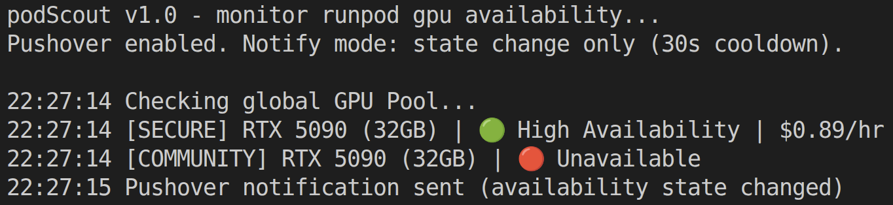

# pod-scout


Lean RunPod GPU watcher. Network-volume aware.

**Purpose:** notify you the moment a usable GPU pod becomes available.

No UI. No dashboards. No watching the marketplace like a dying heart monitor.

Just signal.

## 🖼️ Screenshot



## 🚀 Quick Start

### Requirements

- Python 3.9+
- RunPod API key

### Optional

- Pushover App Token & User Key for notifications

### Install

```bash
pip install -r requirements.txt
```

### Set secrets

```bash
export RUNPOD_API_KEY=your_key
export PUSHOVER_APP_TOKEN=your_token
export PUSHOVER_USER_KEY=your_user
```

### Run

```bash
python pod_scout.py
```

## ⚙️ Config

Edit values at the top of `pod_scout.py`.

Environment variables win. Fallbacks exist. Do not commit secrets.

### Key fields

- `WATCH_GPU_TYPE_IDS`
- `DATACENTER_ID`
- `NETWORK_VOLUME_ID`
- `MARKET_MODE`
- `ENABLE_PUSHOVER`

Prefer internal `gpuTypeId` values. Display names may work until they do not.

## 📐 Routing Logic

Deterministic:

1. `DATACENTER_ID` -> used.
2. Else `NETWORK_VOLUME_ID` -> infer datacenter.
3. Else -> global.
4. If both disagree -> exit.

No guessing. No silent overrides.

Using a network volume? Your pod must spawn in the same datacenter as the storage.
If that datacenter has no GPUs available, you are stuck watching nothing happen.

This script tells you that quickly.

## 🧪 CLI Flags (or lack thereof)

### `--once`

Exit codes:

- `0` -> available
- `1` -> not available
- `2` -> error
- Anything else -> error

No flag zoo.

## 🔔 Notifications

Optional. Disabled by default.

- State-change mode
- Periodic mode
- Cooldowns enforced

No notification storms.

## 🎯 Typical Use Cases

- Waiting for specific GPUs (4090, A100, H100)
- Deploying pods that must match a network volume datacenter
- Running automated launch scripts when capacity appears
- Avoiding manual marketplace refresh loops

## 📜 Philosophy

Fail fast. No hidden config. No external JSON. No feature creep.

It polls. It checks. It notifies.

If GPUs exist, you will know.
If they do not, at least you will not waste an hour clicking refresh.

That is it.

## 🗂️ Repository Layout

```text
pod-scout/
├─ pod_scout.py
├─ requirements.txt
├─ README.md
└─ assets/
   ├─ podscout-banner.png
   └─ pod-scout_screenshot.png
```

## 🤖 AI Assistance

Portions of this project (such as this readme) were generated or refined with the assistance of GPT-5.x (Codex).  
Core logic and design decisions made by me. Boilerplate and repetitive scaffolding were delegated.

Human-reviewed. No blind merges.

---

Do what you want.  
If it works, great.  
If it doesn’t, you have the source.
